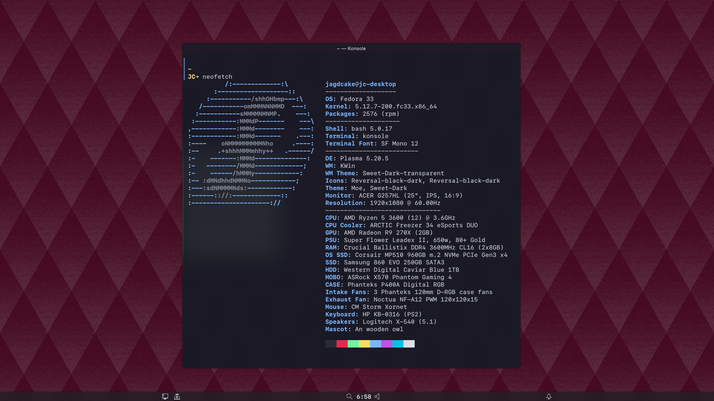

# theRiceFiles

+ **OS**: [Solus 4](https://getsol.us/home/)
+ **DE**: [Budgie](https://github.com/solus-project/budgie-desktop)
+ **Icons**: [la-capitaine-icon-theme](https://github.com/keeferrourke/la-capitaine-icon-theme)
+ **Theme**: [Plata-Noir-Compact](https://gitlab.com/tista500/plata-theme)
+ **Cursor**: from the [Yaru](https://github.com/ubuntu/yaru) theme
___
+ **Terminal**:
    + [Alacritty](https://github.com/jwilm/alacritty)
        + [Config](https://github.com/JagdCake/dotfiles.rice/blob/master/terminal/alacritty/alacritty.yml)
+ **Editor**: [Neovim](https://neovim.io/)
    + [Config](https://github.com/JagdCake/dotfiles.rice/blob/master/neovim_config/init.vim)
